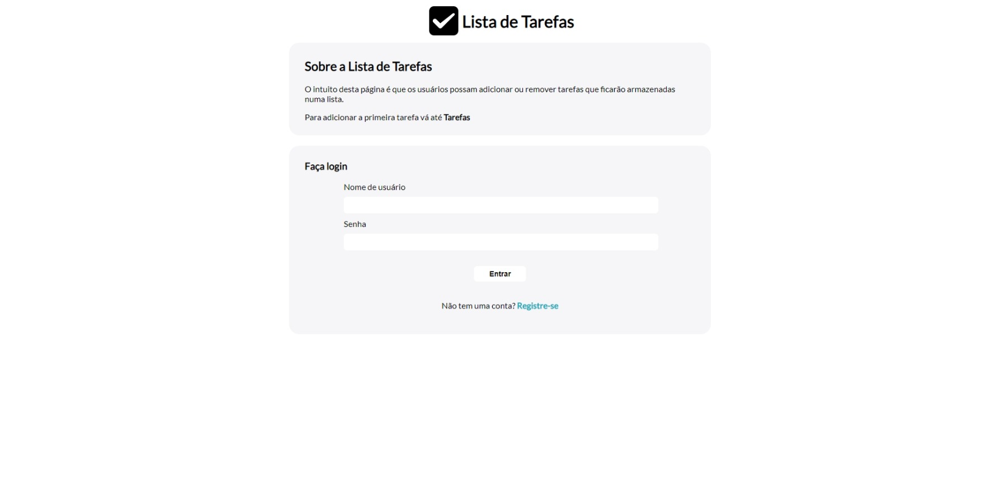
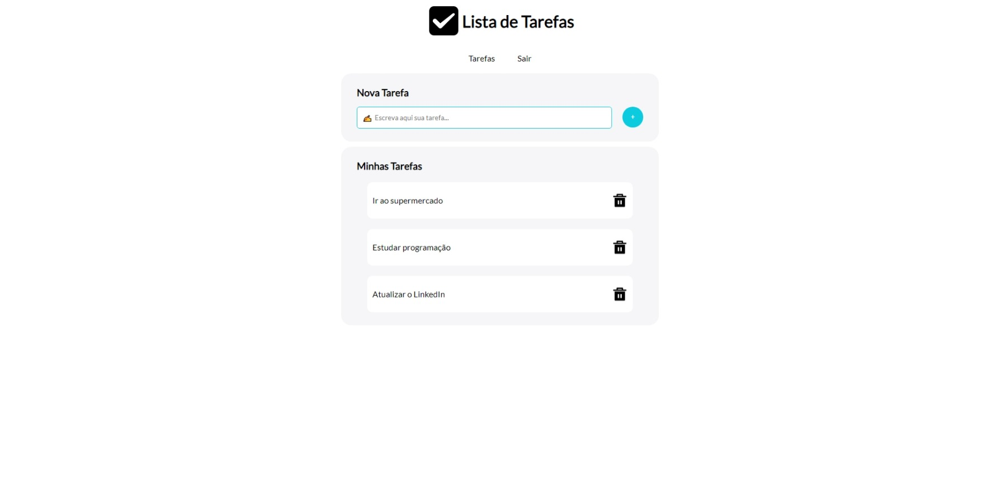

# Lista de Tarefas

## Português

### Lista de tarefas com front-end, back-end e implementação de banco de dados

Com front-end construído em HTML/EJS, CSS e JavaScript, back-end em Node com Express, e MongoDB como banco de dados, a lista de tarefas permite ao usuário adicionar e remover tarefas que ficarão armazenadas de forma segura em um banco de dados não relacional.

## English

### List of tasks with front-end, back-end, and database implementation

With front-end built on HTML/EJS, CSS, and JavaScript, back-end in Node with Express, and MongoDB as a database, the task list allows the user to add and remove tasks that will be stored securely in a non-relational database.

## Screenshots

  
  

## Video
https://user-images.githubusercontent.com/86618257/176065475-86cfb731-f211-422a-a615-ca15e3b9b308.mp4
  
## Stack

      
